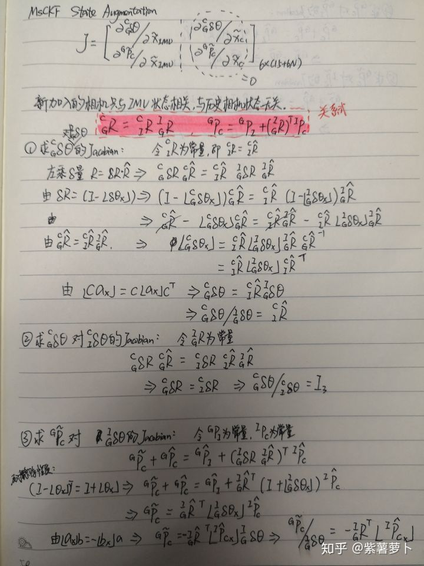
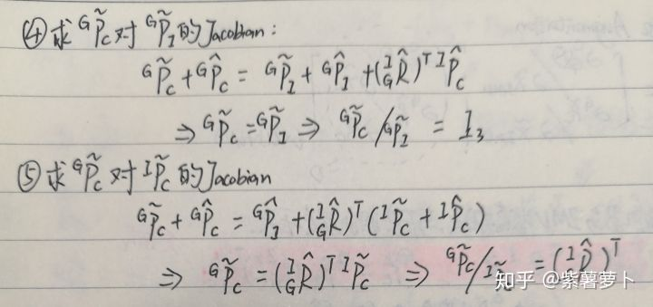

# 阅读总结

> 注意：
> 1. 代码里的状态是 nominal/true state, 协方差是 error state 的 conv，虽然状态转移和更新都应该是对 error state 操作的，但代码里只是用临时变量存储，甚至状态转移压根就没计算 error state（直接根据 nominal state 的状态转移计算），计算出来后就直接怼到 nominal state 中
> 2. 外参、bias、g 都是在 update 阶段更新的，预测阶段只更新 qvp 状态

TODO:

1. 卡方检验
2. processModel 中对 $\Phi$ 的部分项有修改，还没明白原理（参考 [1] 得知跟 [2,3] 能观性约束有关）
3. predictNewState 中 runge-kutta 积分关于 k3_v_dot 和 k2_q 跟我推的不一样，感觉是我推得有问题，但又没找到在哪
4. ~~measurementJacobian 中 $\frac{\partial^{C_{i,1}}\bold{p}_j}{\partial \bold{x}_{C_{i,1}}}$ 对四元数的偏导还不知道怎么推，其他地方在 stateAugmentation 中的 J 也有类似的偏导~~[4] 中推导的很明白
5. measurementJacobian 中 observability constrain 作用不明（能观性约束）
6. ~~removeLostFeatures 中把初始化后的 feature 都删了，为什么在 publish 中还有已初始化的 feature？~~(publish 中初始化的 feature 是在 pruneCamStateBuffer 时初始化的，并且里面初始化的 feature 只更新了被删除帧相关的观测，其他的没有更新，所以在 pruneCamStateBuffer 没有删除，留到了 removeLostFeatures 中更新了全部观测时再删除)
7. 2point-ransac 没看

> 4求导思路：根据IMU位姿转Camera位姿的关系式，对IMU状态中的相关量求导，根据 [公式]对位置量进行展开，根据 [公式]对旋转量进行展开，等式两边相约得到误差量的关系式，然后根据叉乘的性质进行等式变形，最终得到Jacobian。
注意 [公式]的左乘和右乘，这里所有推导用的左乘，而MSCKF的原论文中用的是右乘，所以推导出来的Jacobian会不一样。

## reference

1. [TurtleZhong/msckf_mono](https://github.com/TurtleZhong/msckf_mono)
2. On the consistency of Vision-aided Inertial Navigation
3. Consistency Analysis and Improvement of Vision-aided Inertial Navigation
4. [UMiNS/MSCKF_VIO_MONO](https://github.com/UMiNS/MSCKF_VIO_MONO)
5. https://zhuanlan.zhihu.com/p/76894345
